# 🏡 EstateHub

[](https://github.com/lofilovi/EstateHub-code/actions/workflows/build.yml)
[](LICENSE)

EstateHub is a backend-driven property management dashboard for landlords and property managers: apartments, tenants, rent, inspections, work orders, and accounting in one place.

## Screenshots

| | |
|---|---|
| **Overview** | **Rentals** |
| 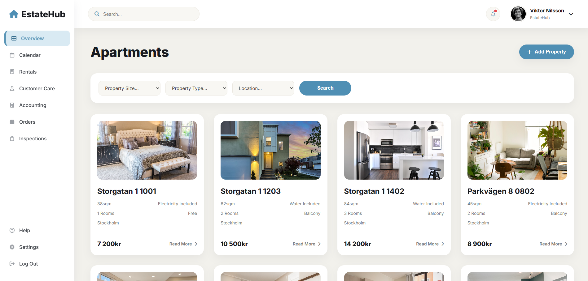 | 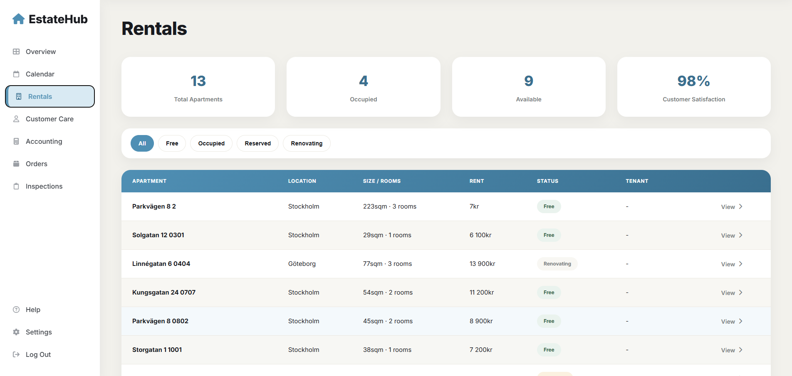 |
| **Customer Care** | **Calendar** |
| 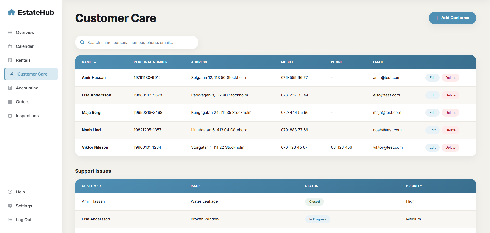 | 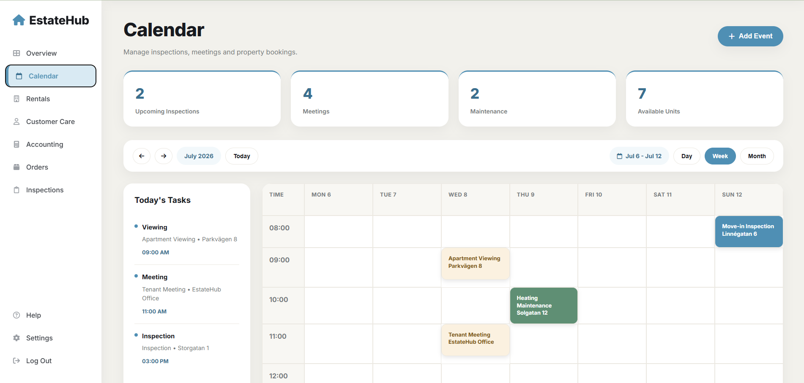 |
| **Accounting** | **Orders** |
| 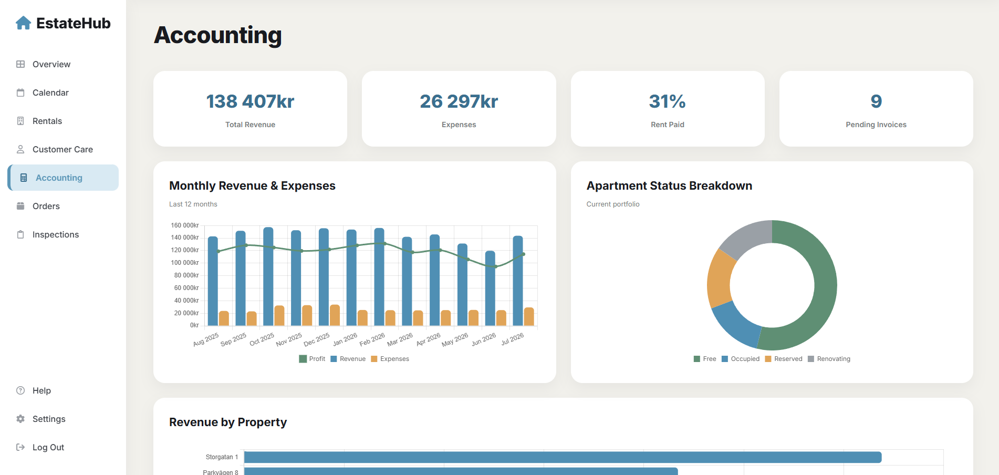 | 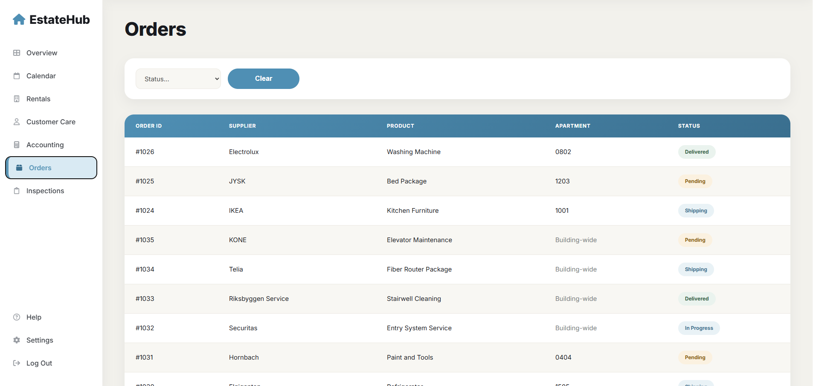 |
| **Inspections** | **Settings** |
| 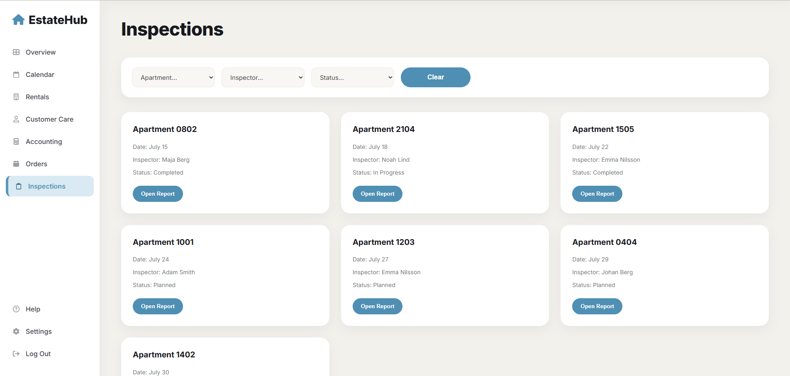 | 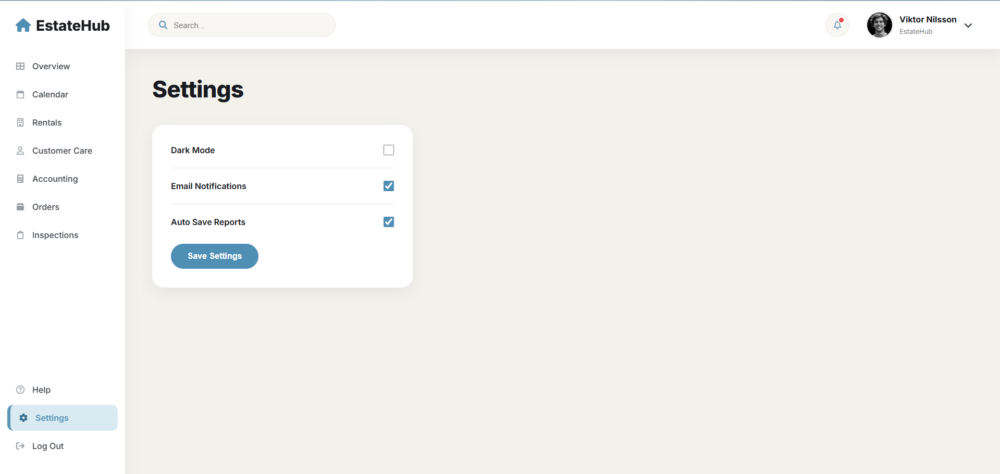 |
| **Help / Contact** | **Login** |
| 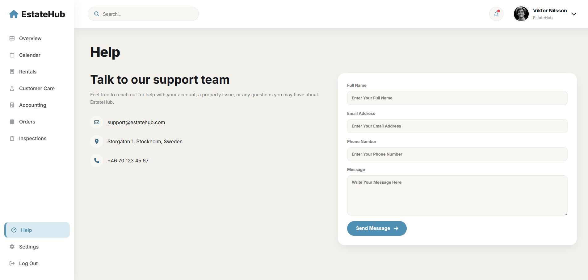 | 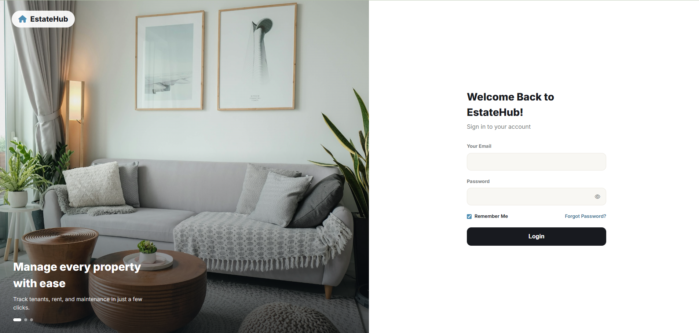 |

**Dark Mode** (toggle it in Settings):

| | |
|---|---|
| 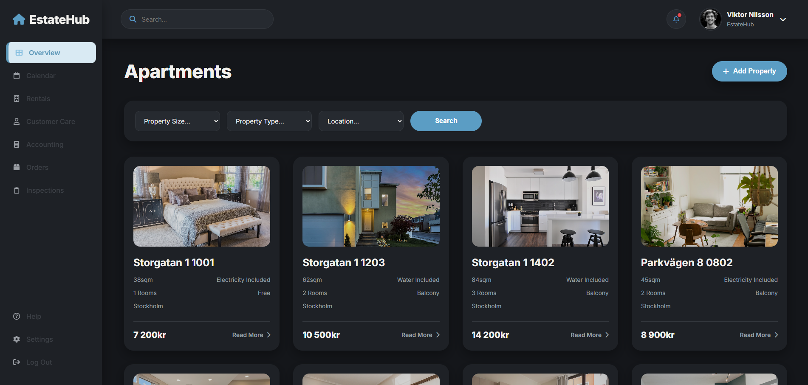 | 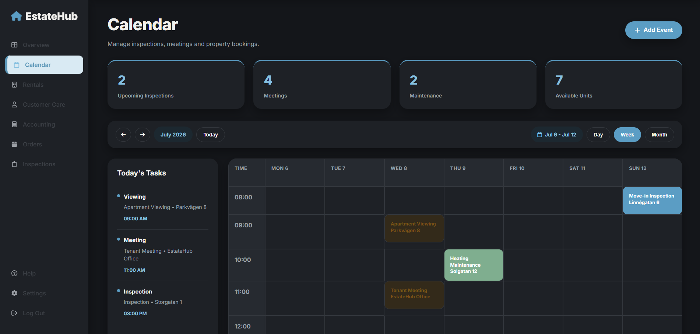 |

## Try it instantly (no setup required)

Just want to look around without installing anything? Grab **`EstateHub-Offline/index.html`** and double-click it — it opens straight in your browser with no .NET, no MySQL, and no database to download.

It's the exact same UI, seeded with the same demo data, but all API calls are served from an in-memory store persisted to your browser's `localStorage` instead of a real backend. Anything you add, edit, or delete is saved locally in your own browser — nothing is sent anywhere. See `EstateHub-Offline/README.md` for details and how to reset the demo data.

The rest of this README covers the full version — the real ASP.NET Core + MySQL app.

## Requirements

- [.NET 10 SDK](https://dotnet.microsoft.com/download) (the project targets `net10.0`)
- [MySQL Server 8.0+](https://dev.mysql.com/downloads/mysql/) running locally

## Setup

1. **Clone the repository.**

2. **Create the database.** Run the schema script against your local MySQL server (this creates the `EstateHub` database and all tables, but no data):

   ```
   mysql -u root -p < EstateHub-code/Database/setup.sql
   ```

3. **Set your connection string.** Open `EstateHub-code/appsettings.json` and replace the placeholder with your own MySQL credentials:

   ```json
   "DefaultConnection": "Server=localhost;Database=EstateHub;User=root;Password=YOUR_MYSQL_PASSWORD;"
   ```

4. **Run the app:**

   ```
   dotnet run --project EstateHub-code
   ```

   On first launch the app automatically seeds demo data — sample properties, apartments, tenants, calendar events, work orders, inspections, and accounting history — into the empty tables you just created.

5. **Open it in your browser:**

   ```
   http://localhost:5008
   ```

The dashboard loads directly — no login required to browse it. If you click **Log Out** in the sidebar and want to sign back in, the default admin account (seeded automatically) is:

- **Email:** `viktor@estatehub.com`
- **Password:** `admin123`

## Tech Stack

- ASP.NET Core 10 / C#
- Entity Framework Core + Pomelo (MySQL)
- MySQL
- HTML, CSS, JavaScript (Chart.js for the Accounting charts)

## Tests

Unit tests live in `EstateHub-code.Tests` (xUnit + EF Core InMemory) and cover the login/password-hashing logic and the inspection report scaffold builder. Run them with:

```
dotnet test EstateHub-code.Tests
```

## Notes

- All demo data (apartments, tenants, orders, inspections, reports, calendar events, accounting) is seeded automatically and is safe to reset by dropping and recreating the database.
- The UI design was made in Figma.
